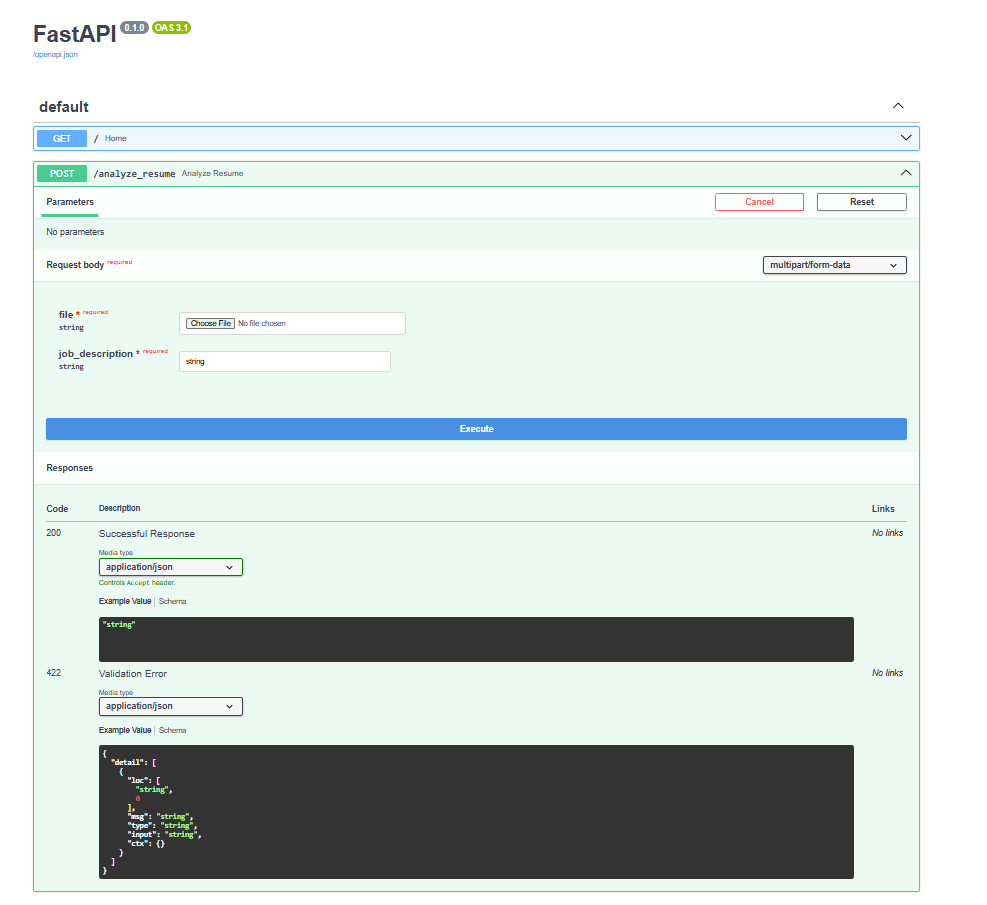

# 🚀 AI Resume Analyzer

## 📌 Problem Statement

Recruiters receive hundreds of resumes for a single job role.
Manually screening them is time-consuming, inconsistent, and inefficient.

---

## 💡 Solution

This project automates resume screening using an AI-powered pipeline.

It:

* Extracts text from resumes (PDF)
* Compares it with job descriptions
* Matches skills intelligently
* Generates a score and improvement suggestions

---

## 🌐 Live Demo

👉 https://ai-resume-analyzer-mymp.onrender.com/docs

*(Upload a resume + paste job description → click Execute)*

---

## 🛠️ Tech Stack

* Python
* FastAPI
* NLP (TF-IDF, keyword matching)
* PDF Processing (pdfminer)
* SQLite (database)
* Uvicorn (server)

---

## ⚙️ Features

### ✅ Resume Upload

* Upload PDF resumes
* Extracts and preprocesses text

### ✅ Job Description Matching

* Accepts custom job descriptions
* Compares resume vs JD

### ✅ Skill Matching Engine

* Matches predefined skills
* Calculates match percentage based on JD

### ✅ Semantic Similarity

* Uses TF-IDF vectorization
* Computes similarity between resume and job description

### ✅ AI Suggestions

* Identifies missing skills
* Helps improve resume quality

### ✅ Database Storage

* Stores analysis results in SQLite
* Tracks past resume evaluations

---

## 📂 Project Structure

```
ai-resume-analyzer/
│
├── app.py
├── resume_parser.py
├── skill_matcher.py
├── suggestions.py
├── database.py
├── requirements.txt
├── README.md
│
├── data/
│   └── skills_db.json
│
├── screenshots/
│   ├── api_ui.png
│   └── output.png
```

---

## ▶️ How to Run Locally

### 1️⃣ Clone the repository

```
git clone https://github.com/GMSKrishna/ai-resume-analyzer.git
cd ai-resume-analyzer
```

### 2️⃣ Create virtual environment

```
python -m venv venv
venv\Scripts\activate
```

### 3️⃣ Install dependencies

```
pip install -r requirements.txt
```

### 4️⃣ Run the server

```
uvicorn app:app --reload
```

### 5️⃣ Open in browser

```
http://127.0.0.1:8000/docs
```

---

## 📸 Screenshots

### 🔹 API UI



### 🔹 Output Example


---

## 🧠 How It Works

1. Resume PDF → Text Extraction
2. Text Cleaning & Normalization
3. Skill Matching using keyword database
4. Score Calculation (based on JD skills)
5. Semantic Similarity using TF-IDF
6. Missing Skills → Suggestions
7. Results stored in database

---

## 🚧 Challenges Faced

* Handling PDF parsing inconsistencies
* Designing accurate skill matching logic
* Balancing keyword vs semantic similarity
* Deploying FastAPI app on cloud (Render)

---

## 🔮 Future Improvements

* Use advanced NLP models (BERT / embeddings)
* Support multiple resumes ranking
* Add frontend UI (React)
* Improve skill extraction using spaCy
* Add authentication system

---

## 💬 Interview Pitch

> Built an AI-powered Resume Analyzer using FastAPI that automates resume screening by extracting text, matching skills with job descriptions, and generating scores with suggestions.
> Integrated NLP techniques like TF-IDF for semantic similarity and deployed the solution on cloud for real-time usage.

---

## ⭐ If you found this useful

Give this repo a ⭐ on GitHub!
